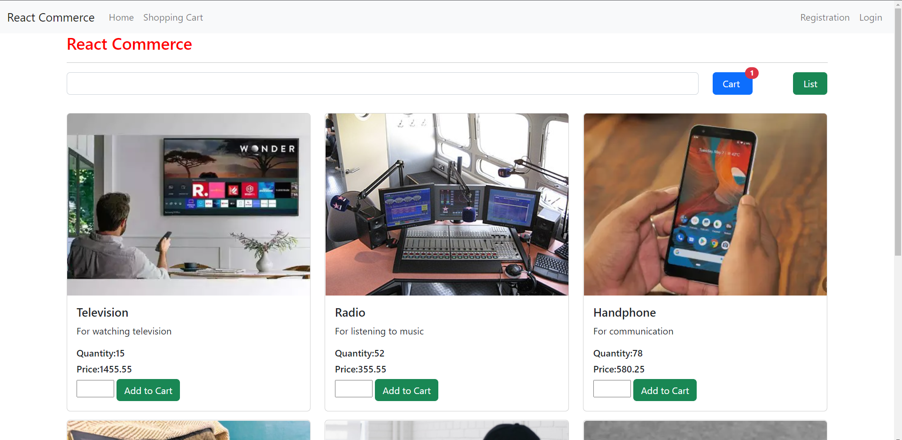
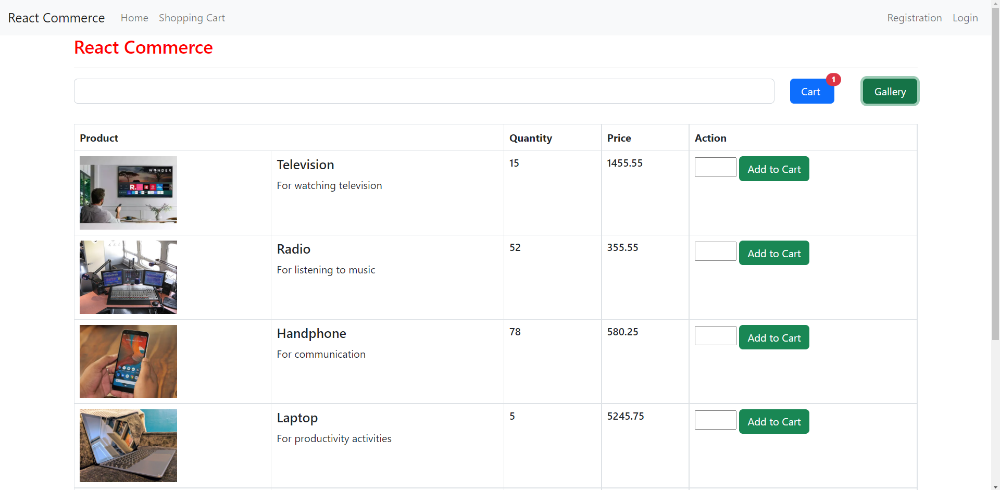
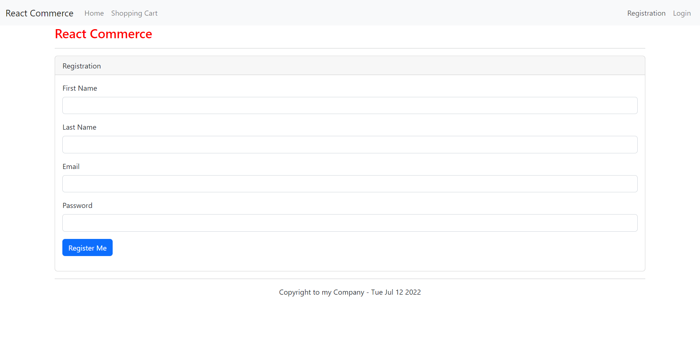
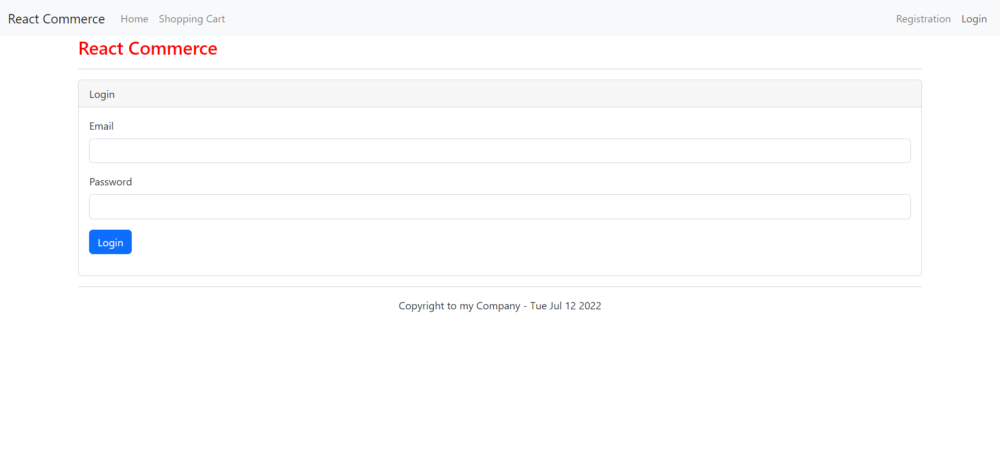
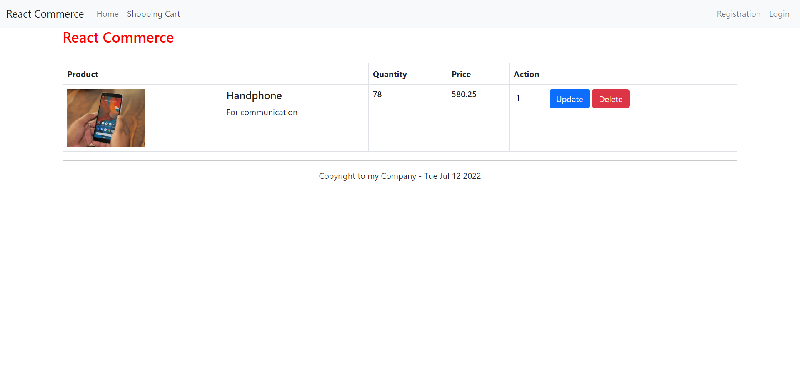

# electronics-commerce

An e-commerce website for selling electronics, built with NodeJS, TypeScript, React, Redux, and Docker with Docker support.

This e-commerce website for selling electronics was developed as part of my ReactJS training during my internship at Dassault Systèmes. I have obtained permission to display and share this work as part of my portfolio. After completing the training, I extended the project by adding Docker container support, and updated the e-commerce website.

## Technologies Used

- Programming Language: Typescript, due to type safety compared to Javascript.
- Technologies:
  - Node.js for backend server. Chosen due to asynchronous nature with non-blocking I/O operations, suitable for real-time applications.
  - React, HTML, and CSS for frontend. React is chosen due to the component-based architecture for reusable components (i.e. product directory). HTML and CSS are the default choices for modern webpages. 
  - Redux for storage and state management. Chosen due to the centralized application state which allows easier management of application behavior.
  - Docker for containerization. Chosen to try and allow application to make deployment easier and more predictable.

## Architecture

This application uses a monolithic application architecture where the entire application is deployed as a single unit. The main reason this is chosen is due to the relative simplicity of the application. 

## Pre-requisites

- NodeJS LTS Version 16.16.0 or later (with npm 8.11.0 installed)

## How to use (Docker)

- Install Docker, change directory into the repository
- Type `docker build -t electronics-commerce-img .` to build the docker image
- Type `docker run -p 3000:3000 -p 8080:8080 electronics-commerce-img` to run the docker image
- Go to `http://localhost:3000` (change port depending on your settings)

## How to use (Non-docker)

- Clone the repository.

### To run the data storage
- Open another powershell into `data` path where `db.json` is located (don't close previous)
- Type `npm install -g json-server` to install JSON Server globally for quick backend
- Type `json-server -p 8080 --watch data/db.json`, then go to `http://localhost:8080` to verify that the database is started

### To run the application
- Open powershell into the root of the project folder (with `package.json`)
- Type `npm install` to install dependencies of the project
- Type `npm start` to start the project
- Go to `http://localhost:3000` (change port depending on your settings)

## Contents

- `data` folder stores the JSON database.
- `public` folder stores site metadata, favicons, and ReactJS starting point
- `catalog` folder provides components that are used in displaying products in a catalog fashion.
    - `ProductGalleryComponent.tsx` displays product in a "gallery" (aka Grid-like) format.
    - `ProductListComponent.tsx` displays product in a "list" format.
    - `ProductsComponent.tsx` is the holder of either gallery or list of products.
- `common` folder houses components of the website that are not part of the catalog.
- `models` define the format for the JSON database structure & data.
- `shoppingcart` is the same as `catalog` except it handles the shopping cart side and only displays in a "list" format
- `store` is where Redux functionality is defined especially on credentials persistence.

## Features

### Homepage (List)

### Registration

### Login

### Shopping cart

